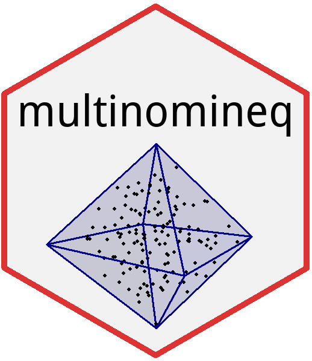

<!--
[](http://cran.r-project.org/package=multinomineq)
[](http://cranlogs.r-pkg.org/badges/multinomineq)
[](http://cranlogs.r-pkg.org/badges/grand-total/multinomineq)
-->

[](https://www.gnu.org/licenses/gpl-3.0.en.html)
[](https://travis-ci.org/danheck/multinomineq)
[](https://codecov.io/github/danheck/multinomineq?branch=master)


R package `multinomineq`
=====



Implements Gibbs sampling and Bayes factors for multinomial models with linear
inequality constraints on the vector of probability parameters. As special
cases, the model class includes models that predict a linear order of binomial
probabilities (e.g., p[1] < p[2] < p[3] < .50) and mixture models assuming that
the parameter vector p must be inside the convex hull of a finite number of
predicted patterns (i.e., vertices).

Inequality-constrained multinomial models have applications in multiple areas 
in psychology and beyond:

* Risky decisions between different gambles to test choice axioms such as 
  transitivity (Regenwetter et al., 2012, 2014).
* Outcome-based strategy classification of multiattribute decision strategies such as
  take-the-best (TTB) or weighted additive (WADD; Bröder & Schiffer, 2003; Heck et al., 2017).
* Testing deterministic axioms of measurement and choice (Karabatsos, 2005; Myung et al., 2005).
* Fitting and testing nonparametric item response theory models (Karabatsos & Sheu, 2004).
* Order-constrained contingency tables (Klugkist et al., 2007, 2010).
* Testing stochastic dominance of response time distributions (Heathcote et al., 2010).
* Cognitive diagnostic assessment (Klugkist et al., 2007, 2010).

## References and Vignette

A formal definition of inequality-constrained multinomial models and the 
implemented computational methods for Bayesian inference is provided in:

* Heck, D. W., & Davis-Stober, C. P. (2019). Multinomial models with linear 
  inequality constraints: Overview and improvements of computational methods 
  for Bayesian inference. *Journal of Mathematical Psychology, 91*, 70-87. 
  https://doi.org/10.1016/j.jmp.2019.03.004 
* Preprint version: https://arxiv.org/abs/1808.07140
  
Please cite this paper if you use `multinomineq` in publications.

The package vignette provides a short introduction of how to apply the main functions of `multinomineq`:
```
vignette('multinomineq_intro')
```

The vignette is also available <https://www.dwheck.de/vignettes/multinomineq_intro.html>.


## Installation

The package `multinomineq` can directly be installed from CRAN via:
```
install.packages("multinomineq")
```

Alternatively, if developer tools for R are installed (see instructions below),
the most recent version of `multinomineq` can also be installed from GitHub via:
```
### install dependencies:
install.packages("devtools","RcppArmadillo","RcppProgress",
                 "Rglpk", "quadprog", "RcppXPtrUtils")

### install from Github:
devtools::install_github("danheck/multinomineq")
```

<!--
If the compilation of the source package causes any problems, the following code 
will install a binary version of `multinomineq` (only for Windows):
```
install.packages("drat")
drat::addRepo("danheck")
install.packages("multinomineq")
```
-->

To transform between the vertex (V) and the inequality (A*x<b) representation of 
a polytope, it is necessary to install the package `rPorta`. The package is available on
GitHub (https://github.com/TasCL/rPorta). The package cannot be compiled with R>=4.0.0.
For older R versions, the precompiled package can be installed via:
```
install.packages("rPorta", repos = "https://danheck.github.io/drat/")
```


## Compilation of Source Packages

On Linux, GLPK libraries have to be installed via the console:
```
sudo apt-get install libglpk-dev
```

To compile C++ code, Windows and Mac require 
[Rtools](https://cran.r-project.org/bin/windows/Rtools/) and 
[Xcode Command Line Tools](https://www.maketecheasier.com/install-command-line-tools-without-xcode/), respectively. 
Moreover, on Mac, it might be necessary to install the library `gfortran` manually by typing the following into the console 
([required to compile the package `RcppArmadillo`](http://thecoatlessprofessor.com/programming/rcpp-rcpparmadillo-and-os-x-mavericks-lgfortran-and-lquadmath-error/)):

```
curl -O http://r.research.att.com/libs/gfortran-4.8.2-darwin13.tar.bz2
sudo tar fvxz gfortran-4.8.2-darwin13.tar.bz2 -C /
```


